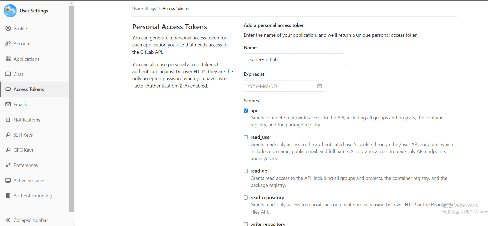

# Usage

on Packer.nvim

```
packer.startup(
    function()
        -- other plugins
        
        use 'HaomingJu/LeaderF-gitlab'
    end
    )

vim.cmd([[
    let g:Lf_GitlabToken = "DEMO_TOEKN"                         --- Please get youself gitlab-token
    let g:Lf_GitlabURL = "http://192.168.3.148/api/v4"          --- Please check your gitlab server IP
    let g:Lf_PreviewResult.mr = 1                               --- Auto preview
]])
```

on Plugin
```
call plug#begin('~/.config/vimPlugin')

" other plugins
Plug 'Haoming/LeaderF-gitlab'

call plug#end()


let g:Lf_GitlabToken = "DEMO_TOEKN"                         --- Please get youself gitlab-token
let g:Lf_GitlabURL = "http://192.168.3.148/api/v4"          --- Please check your gitlab server IP
let g:Lf_PreviewResult.mr = 1                               --- Auto preview
```

# Config

`LeaderF-gitlab`需要配置两个必要量才可以正常工作, 即gitlab的api地址以及相应的认真token

### g:Lf_GitlabToken

`g:Lf_GitlabToken` 为gitlab上的个人AccessToken `gitlab -> Profile -> Access Tokens`

Token Scope只需要 `api` 权限



### g:Lf_GitlabURL

一般情况下为gitlab访问地址后加`/api/v4`

例如 `https://gitlab.com/api/v4`, 或者自行搭建的服务'http://192.168.0.1/api/v4' 等


### g:Lf_PreviewResult.mr(default = 0, optional)

可选变量, 默认为0.

若置为1, 则自动将当前光标所在行的merge request

# Usage

`:Leaderf mr` 列出所有assigned to you & opened的merge request

# TODO
- [ ] 将命令`Leaderf mr`集成到`LeaderF*`命令中
- [x] 补充完整的使用说明, 如何获取token, 如何在不同插件管理器中配置
- [ ] 选择单个条目后, 进入二级命令: `open url` 'open info'
- [x] Preview在NORMAL模式下失效
